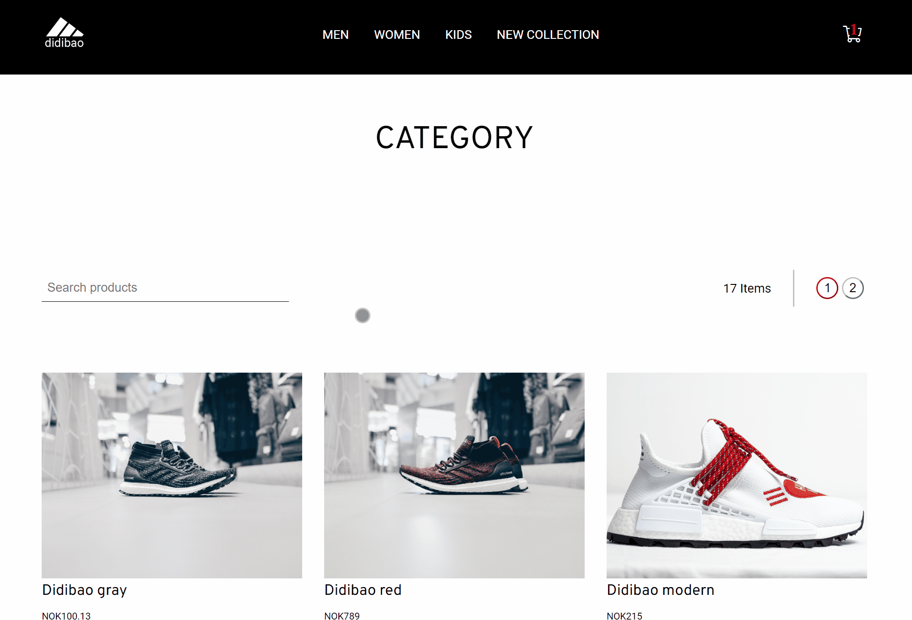
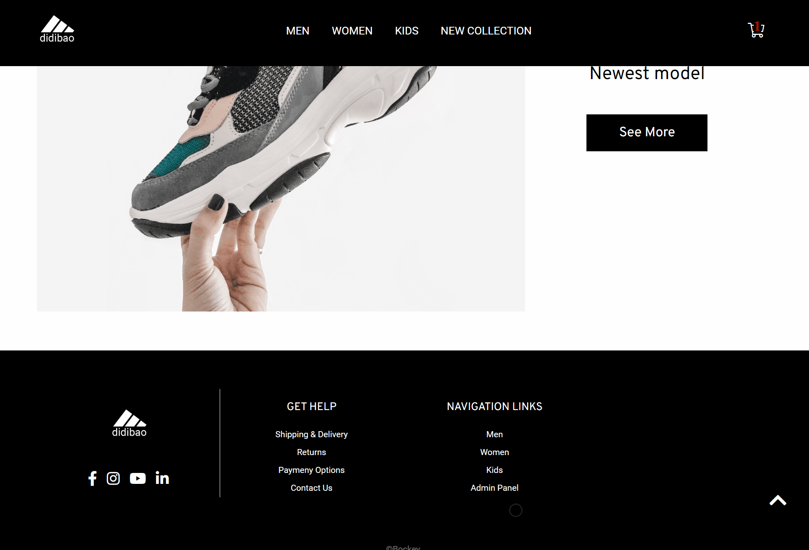

  

 

<h1>Semester project 2</h1> 

- E-commerce site - sneakers shop.
- School project

## Description

E-commerce site with list of products page and product specific page. Working search bar, add and remove to cart (local storage used).
Login option is available for admin panel where you can edit, add new and delete products (route is protected if user is not logged in).
Some options are limited because of the difference between design and values returned from API (like color and size).
Checkout of course is not available.
Api created with Strapi and hosted on Heroku (therefore slower response). 

Live at https://didibao.netlify.app

## Home page

 

## Search

 

## Admin page

 

## Contact

This is where you can leave your social links for people to contact you, such as a LinkedIn profile or Twitter link e.g.

[My portfolio page](https://bockey.one/)

[My LinkedIn page](https://www.linkedin.com/in/boris-gudelj-a535091b4/)

